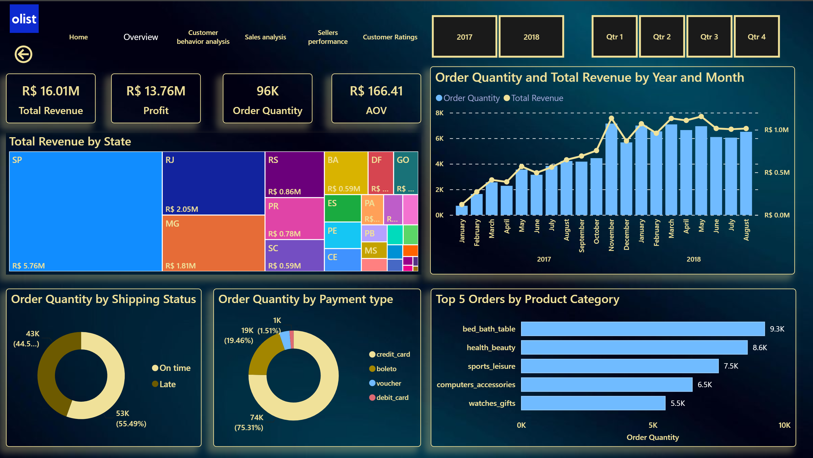

# 📦 Olist E-commerce Business Performance Report

A comprehensive Power BI dashboard designed to analyze the business performance of Olist, a Brazilian e-commerce and retail-tech platform. This report provides deep insights into sales trends, customer behavior, seller performance, and customer satisfaction.

## 📈 Dashboard Preview

**🔗 [CLICK HERE TO VIEW THE LIVE INTERACTIVE DASHBOARD](https://app.powerbi.com/view?r=eyJrIjoiNDAwOGQ4ZmQtNTRmOS00NGJlLTgzZmItZjM5NDA5YTllMDkxIiwidCI6IjM3MGZiM2I4LTMzMDYtNDg5MC05MDYzLWNjMDhiZTc4ODI1NyIsImMiOjEwfQ%3D%3D)**

## 📊 Key Features
- **Business Overview:** Total revenue, transaction volumes, and payment behaviors.
- **Customer Behavior:** RFM Segmentation and seasonal trends.
- **Sales Analysis:** Tracking sales performance, profit margins, and geographic distribution across Brazilian states.
- **Seller Performance:** Monitoring active sellers growth, delivery times, and cancellation rates.

## 📁 Tools & Technologies
- **Power Query:** Data inspection and transformation.
- **Power BI:** Data modeling, DAX, interactive dashboard design.
- **Power BI Service:** Cloud deployment and stakeholder sharing.
